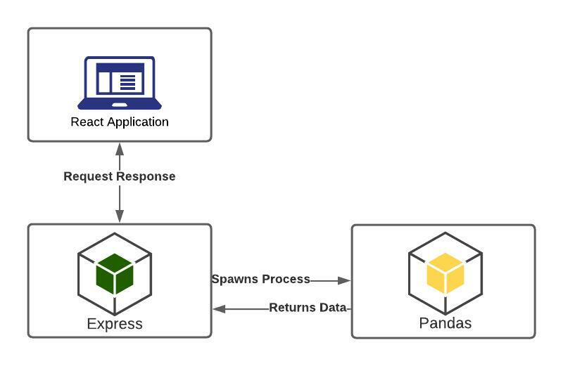
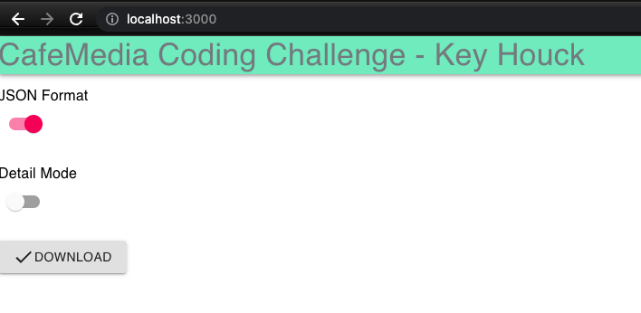
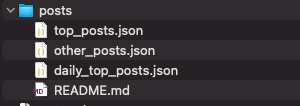

<!-- PROJECT LOGO -->
<br />

<h3 align="center">CafeMedia Code Challenge: Key Houck</h3>

<!-- TABLE OF CONTENTS -->
<details>
  <summary>Table of Contents</summary>
  <ol>
    <li>
      <a href="#about-the-project">About The Project</a>
      <ul>
        <li><a href="#built-with">Built With</a></li>
      </ul>
    </li>
    <li>
      <a href="#getting-started">Getting Started</a>
      <ul>
        <li><a href="#prerequisites">Prerequisites</a></li>
        <li><a href="#installation">Installation</a></li>
      </ul>
    </li>
    <li><a href="#usage">Usage</a></li>
    <li><a href="#roadmap">Roadmap</a></li>
    <li><a href="#contributing">Contributing</a></li>
    <li><a href="#license">License</a></li>
    <li><a href="#contact">Contact</a></li>
    <li><a href="#acknowledgments">Acknowledgments</a></li>
  </ol>
</details>

<!-- ABOUT THE PROJECT -->

## About The Project

This project addresses a code challenge given by CafeMedia. As the architecture shows, the application is simple at it's core. A react frontend calls to a nodejs/express server which spawns a pandas child process to do heavy data analytics.

The user is provided toggle swtich flags to pick between JSON and CSV formats with a detailed mode for dataframe handling. A download button then fetches the data and a .zip file is provided with the requested arguments.

**Figure 0.1 - Overall Architecture**


<p align="right">(<a href="#top">back to top</a>)</p>

### Built With

-   [React.js](https://reactjs.org/)
-   [MaterialUI](https://mui.com/)
-   [NodeJS](https://nodejs.org/en/)
-   [Express](https://expressjs.com/)
-   [Pandas](https://pandas.pydata.org/)

<p align="right">(<a href="#top">back to top</a>)</p>

<!-- GETTING STARTED -->

## Getting Started

This is an example of how you may give instructions on setting up your project locally.
To get a local copy up and running follow these simple example steps.

### Prerequisites

There is a `package.json` contained within the root directory and the `client` folder. In order to get the necessary packages, you will need to first install necessary dependencies.

You will need to install python (https://www.python.org/downloads/) or conda (https://www.anaconda.com/products/individual) related dependencies to spawn child processes. Generally, installing a python package and the extension for your chosen IDE should suffice. You could technically run .py related files within a conda environment of your choice or IDE (jupyter, spyder, etc.) in order to test if the functionality works. If so, then you should be good to go and the child processes will work. Additional details on what conda, python, or sub processing is beyond the scope of this README for detailed instructions.

The following is a shell script to run for installing dependencies in the root of your project:

-   npm install on root directory
    `sh npm install `
    You will also need to change directories to the client and install dependencies as well:

-   npm install on client directory
    ```sh
    cd client
    npm install
    ```

### Let's Run It

1. You will need to run multiple terminals (locally) to test
2. In terminal 1, run the following command from your root directory:
    ```sh
    <!-- For running your client server -->
    npm run start:client
    ```
3. In terminal 2, run the following command from your root directory:
    ```sh
    <!-- For running your express server -->
    npm run start:server
    ```
4. Within a browser, go to (http:localhost:3000) which should show the react application
 <p align="right">(<a href="#top">back to top</a>)</p>

<!-- USAGE EXAMPLES -->

## Usage

Use cases for this application are fairly straghtforward. At the main page of the application, there will be two switches that will allow you to select JSON or defaults to CSV as a file format. You are also given a switch to have a detailed mode or defaults to a `'id'` mode that only sends back id's related to requirements. A download button is present to zip the contents to your download folder, given you access to the `.json` or `.csv` files

**Figure 1.0 - Main page with JSON selected**


**Figure 2.0 - Resulting downloaded zip**


<p align="right">(<a href="#top">back to top</a>)</p>

## Areas To Improve

1. Frontend needs test (jest and enzyme) with a state manager and separation of HTTP calls. Try to keep most functional components pure.
2. API needs to be refactored to a better pattern (Repo -> DAO, Controller -> Manager -> Helper). Currently, the single API endpoint does way too much.
3. Tests need to increase in coverage, breath, and depth. Unit tests are marginal at best especially when looking at pytests for the pandas spawn process.
4. It would be helpful to create fixtures, mocks, and consistent test services for quicker testing and debugging
5. Dataframes and vectorized functions could probably be improved a bit within the python file. The file could also be separated to make pytesting easier.
6. To make this into a typical enterprise application, we will need to add build pipelines, swagger documentation, sonar checks, configuration files, etc. I have added some sample files (some are blank) to show my line of reasoning.

<!-- CONTACT -->

## Contact

Key Houck - keyyun2028@gmail.com

<p align="right">(<a href="#top">back to top</a>)</p>

<!-- ACKNOWLEDGMENTS -->

## Acknowledgments

1. Yunji for making sure I take breaks and drink water
2. Teemo for helping me relax
3. CafeMedia for reviewing my code

<p align="right">(<a href="#top">back to top</a>)</p>
